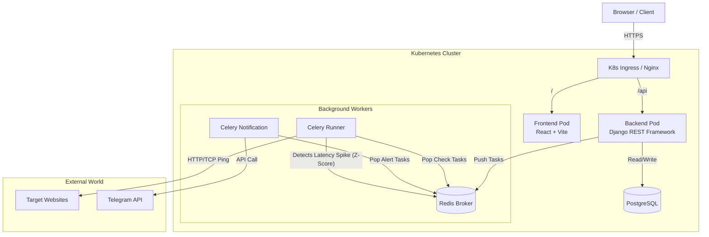

# StatusHawk 🦅

<div align="center">

**A robust, self-hosted uptime monitoring and observability platform**

Monitor your infrastructure's health in real-time • Detect statistical anomalies • Get instant Telegram alerts

[](LICENSE)
[](#)
[](#kubernetes-deployment-helm)
[](#)
[](#)
[](#)

[Features](#-key-features) • [Quick Start](#-quick-start) • [Architecture](#-system-architecture) • [Deployment](#-deployment-options) • [Contributing](#-contributing)

</div>

---

## 🌟 Key Features

- **Real-time Monitoring** - HTTP(s) and TCP endpoint monitoring with configurable check intervals
- **Predictive Anomaly Detection** - Z-Score statistical analysis to detect latency spikes before they become outages
- **Instant Alerts** - Telegram notifications with "Magic Link" authentication
- **Scalable Architecture** - Dedicated Celery workers for check execution and alerting
- **Interactive Dashboards** - Response time heatmaps, uptime statistics, and performance leaderboards
- **Self-Hosted** - Full control over your monitoring data and infrastructure

## 🏗 System Architecture

StatusHawk uses an event-driven microservices architecture to separate monitoring logic from the web interface, ensuring the dashboard remains responsive even when monitoring thousands of endpoints.




## 🛠 Tech Stack

### Frontend
- **React 18** with Vite for fast development
- **Shadcn/UI** + TailwindCSS for modern UI components
- **TanStack Query** (React Query) for data fetching
- **Recharts** for data visualization

### Backend
- **Python 3.11** + **Django 5**
- **Django REST Framework** for API endpoints
- **Celery** for asynchronous task processing
- **NumPy/Statistics** for anomaly detection algorithms

### Infrastructure
- **PostgreSQL** - Primary database
- **Redis** - Message broker and cache
- **Docker** & **Docker Compose** - Local development
- **Kubernetes** + **Helm** - Production deployment

## 🚀 Quick Start

### Prerequisites
- Docker & Docker Compose installed
- (Optional) Kubernetes cluster for production deployment

### Local Development

```bash
# Clone the repository
git clone https://github.com/yourusername/statushawk.git
cd statushawk

# Create environment file
cp .env.example .env

# Start all services
docker compose up -d --build

# Access the application
# Frontend: http://localhost:5173
# Backend API: http://localhost:8000/api
```

The application will automatically:
- Run database migrations
- Create a superuser (admin/admin_password_123)
- Start Celery workers for monitoring and notifications

## 📦 Deployment Options

### Docker Compose (Development)

Best for local development and testing:

```bash
docker compose up -d
```

### Kubernetes Deployment (Helm)

Production-ready deployment with auto-scaling and high availability:

#### 1. Configure Secrets

Create `my-secrets.yaml` (do NOT commit this file):

```yaml
telegram:
  token: "YOUR_TELEGRAM_BOT_TOKEN"

django:
  secretKey: "YOUR_SECURE_DJANGO_SECRET_KEY"

postgresql:
  auth:
    postgresPassword: "SECURE_DATABASE_PASSWORD"
```

#### 2. Install with Helm

```bash
# Install or upgrade the release
helm upgrade --install statushawk ./infra/charts/statushawk \
  -f ./infra/charts/statushawk/values.yaml \
  -f my-secrets.yaml

# Check deployment status
kubectl get pods
kubectl get services
```

#### 3. Access the Application

For Minikube:
```bash
# Get Minikube IP
minikube ip

# Add to /etc/hosts
echo "$(minikube ip) api.statushawk.local" | sudo tee -a /etc/hosts

# Access at http://api.statushawk.local
```

For production clusters, configure your DNS to point to the Ingress controller.

## 📂 Project Structure

```
statushawk/
├── services/
│   ├── backend/                 # Django Backend
│   │   ├── app/
│   │   │   ├── monitor/        # Monitoring logic & services
│   │   │   ├── notifications/  # Alert system
│   │   │   └── common/         # Shared utilities
│   │   ├── config/             # Django settings
│   │   └── manage.py
│   └── frontend/               # React Frontend
│       ├── src/
│       │   ├── components/     # UI components
│       │   ├── pages/          # Page components
│       │   └── lib/            # Utilities
│       └── package.json
├── infra/
│   └── charts/
│       └── statushawk/         # Helm chart
│           ├── templates/      # K8s manifests
│           └── values.yaml     # Configuration
├── docker-compose.yaml         # Local development
└── README.md
```

## 🧪 Testing

### Backend Tests

```bash
# Run all tests
docker compose exec backend pytest

# Run with coverage
docker compose exec backend pytest --cov=app

# Run specific test module
docker compose exec backend pytest app/monitor/test/test_services.py
```

### Test Coverage
- **194 total tests** covering models, services, APIs, and integrations
- Monitor app: 120 tests
- Notifications app: 56 tests
- Common utilities: 18 tests

## 🔧 Configuration

### Environment Variables

Key environment variables (see `.env.example`):

```bash
# Django
DJANGO_SETTINGS_MODULE=config.settings.local
SECRET_KEY=your-secret-key

# Database
DB_ENGINE=django.db.backends.postgresql
DB_HOST=postgres
DB_PORT=5432
DB_NAME=statushawk
DB_USER=postgres
DB_PASSWORD=password

# Redis
CELERY_BROKER_URL=redis://redis:6379/0

# Telegram
TELEGRAM_BOT_TOKEN=your-bot-token
TELEGRAM_BOT_NAME=your-bot-name
```

### Helm Values

Customize deployment in `values.yaml`:

```yaml
# Scale API pods
api:
  replicaCount: 3

# Configure worker autoscaling
runner:
  autoscaling:
    enabled: true
    minReplicas: 2
    maxReplicas: 10
    targetCPUUtilizationPercentage: 70
```

## 📊 Features in Detail

### Anomaly Detection

StatusHawk uses Z-Score statistical analysis to detect latency anomalies:

- Calculates baseline from last 50 successful checks
- Flags responses > 2 standard deviations from mean
- No training required - works out of the box
- Configurable sensitivity threshold

### Telegram Integration

- Magic Link authentication (no password needed)
- Instant downtime alerts
- Anomaly detection notifications
- Customizable alert templates

### Monitoring Capabilities

- **HTTP/HTTPS** monitoring with custom headers
- **TCP** port monitoring
- Configurable check intervals (1-60 minutes)
- Response time tracking
- Status code validation
- SSL certificate monitoring

## 🤝 Contributing

Contributions are welcome! Please follow these steps:

1. Fork the repository
2. Create a feature branch (`git checkout -b feature/amazing-feature`)
3. Commit your changes (`git commit -m 'Add amazing feature'`)
4. Push to the branch (`git push origin feature/amazing-feature`)
5. Open a Pull Request

### Development Guidelines

- Write tests for new features
- Follow PEP 8 for Python code
- Use ESLint/Prettier for JavaScript/TypeScript
- Update documentation for API changes

## 📝 License

Distributed under the MIT License. See [LICENSE](LICENSE) for more information.

## 🙏 Acknowledgments

- Built with [Django](https://www.djangoproject.com/) and [React](https://react.dev/)
- UI components from [Shadcn/UI](https://ui.shadcn.com/)
- Deployed on [Kubernetes](https://kubernetes.io/)

## 📧 Contact

Project Link: [https://github.com/yourusername/statushawk](https://github.com/yourusername/statushawk)

---

<div align="center">
Made by the Bobur
</div>
