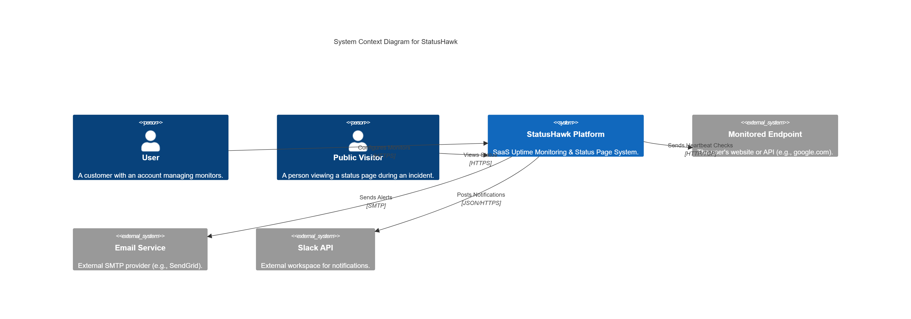
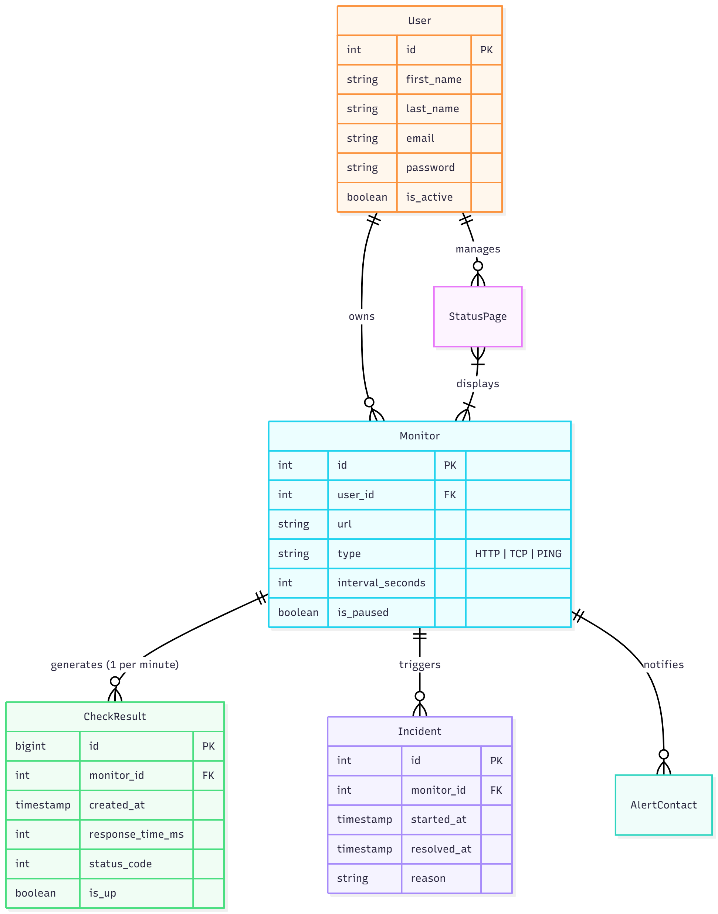
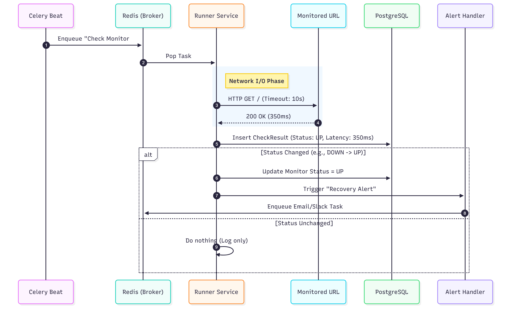

# System Architecture of project StatusHawk

This document contains system architecture of StatusHawk - Uptime Monitoring & Status Page. The core function is simple: a user registers, provides a URL, and platform continuously checks that URL's availability and response time, generating alerts and a public status page if it goes down. We build the application based on Microservices architecture for scalability.

## Introduction

### Project Ovewview

StatusHawk is an open-source, multi-tenant SaaS platform designed for uptime monitoring and incident communication. It allows users to register endpoints (HTTP/HTTPS, TCP, Ping) and continuously monitors their availability and response metrics. When downtime is detected, the system triggers multi-channel alerts and updates public-facing status pages.

Unlike simple cron-based scripts, StatusHawk is engineered as a distributed system capable of scaling to handle thousands of concurrent checks with high precision and minimal latency.

### Purpose and Scope

The primary objective of this architecture is to provide a robust framework that separates the management of monitors (CRUD) from the execution of monitors (Runners).

In Scope:

- Uptime Monitoring: Periodic HTTP, TCP and ICMP checks.
- Status Pages: Publicly accessible pages displaying historical uptime and active incidents.
- Alerting: Integration with Email.
- Team Management: Multi-user accounts with role-based access.

Out of Scope:

- Agent-based Monitoring: We do not install agents on user servers.
- Log Aggregation: We monitor availability, not internal application logs.

## System architecture

### Architectural Goals

Decisions in this document are driven by the following quality attributes:

- **Scalability**: The system must handle a growing number of monitors without degrading check accuracy. The Runner Service must be horizontally scalable to distribute the load of network requests.

- **Isolation**: A failure in the Web Dashboard or API must not stop the Runner Service from performing checks and sending alerts.

- **Data Integrity**: Historical uptime data is immutable and must be preserved accurately for SLA reporting.

- **Developer Experience**: As an open-source project, the system must be runnable locally via Docker Compose with minimal configuration, despite its distributed nature.

This diagram represents the high-level architecture of StatusHawk, illustrating the separation of concerns between the user-facing application (React), the API/Management layer (Django), and the distributed execution layer (Celery Runners).

### Service description

|Service Name|Responsibility|Tech Stack|Key Dependencies|
|------------|--------------|----------|----------------|
|Frontend|Delivers the Single Page Application (SPA) bundle to the browser. Handles client-side routing and visualization of uptime graphs.|"React 18, Vite, TailwindCSS"|Nginx (serving static files)|
|API Gateway|"The ""Brain"" of the operation. Manages Users, Billing, and Monitor Configurations. It does not perform network checks itself. It exposes a public API for status pages and a private API for the dashboard."|"Python 3.10+, Django 4, DRF"|"PostgreSQL, Redis"|
|Runner Service|"The ""Muscle"" of the operation. Stateless worker nodes that pick up check tasks from the queue, execute network requests (HTTP/TCP), and determine if an endpoint is UP or DOWN."|"Python 3.10+, Celery"|"Redis (Broker), PostgreSQL (Result storage)"|
|Scheduler (Beat)|"A singleton process (part of the Runner stack) that reads active monitors from the DB and creates task definitions in Redis at the defined interval (e.g., every 60s)."|Celery Beat|"Redis, PostgreSQL|

### Technology Decisions

#### Why Microservices?

While a monolith is simpler, we separated the API from the Runner to ensure isolation.

- Scenario: A user configures a monitor that triggers an infinite loop or a timeout.
- Result: This might crash a Runner worker process, but the API and Dashboard remain 100% responsive for other users.

#### Why Redis?

Redis serves a dual purpose in StatusHawk:

1. Queue Broker: It manages the high-throughput stream of "Check Now" tasks between the Scheduler and Runners.
2. Cache: Public status pages are read-heavy. To prevent the Database from crashing during a widespread outage (the "thundering herd" problem), status page JSON is cached in Redis for 60 seconds.

## Data Architecture

The database schema centers around the `Monitor` entity, which links users to their configuration and the resulting historical data.

## Core workflow

### Failure Confirmation Logic (Avoiding False Positives)

To prevent "flapping" (sending alerts for temporary network blips), StatusHawk implements a Double-Check Strategy. We do not alert on the very first socket timeout.

#### Logic Flow

1. First Failure: The Runner detects a timeout or 500 error. The Runner does not write to the DB yet. It immediately triggers a "Retry" within the same process (or re-queues high priority).
2. Second Failure (Confirmation): The retry also fails.
    - Action: The incident is confirmed.
    - DB: A new Incident row is created.
    - Alert: Notifications are dispatched to the user.
